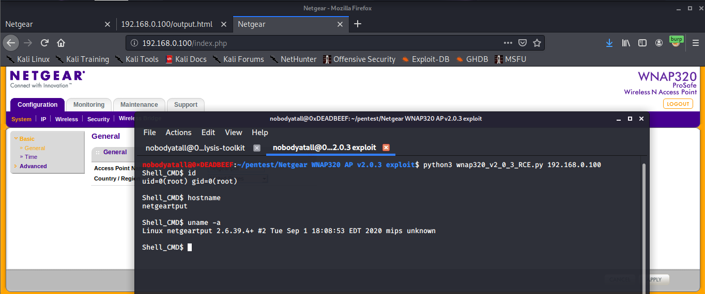

# Netgear WNAP320 Access Point Firmware Version 2.0.3 RCE 

## The write-up can be read in my writeup repo under firmware analysis 

IoT Device: Netgear WNAP320 Access Point

Firmware version: v2.0.3

Vulnerability: Remote Command Execution on /boardDataWW.php macAddress parameter

Notes: The RCE doesn't need to be authenticated

## YouTube Video Link (Firmware Analysis on Netgear WNAP320 Access Point & Exploit the Vulnerable):
https://www.youtube.com/watch?v=uHFNTK_Jd5g

